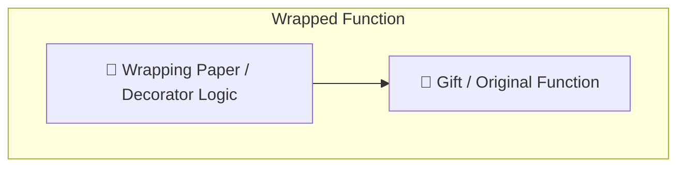
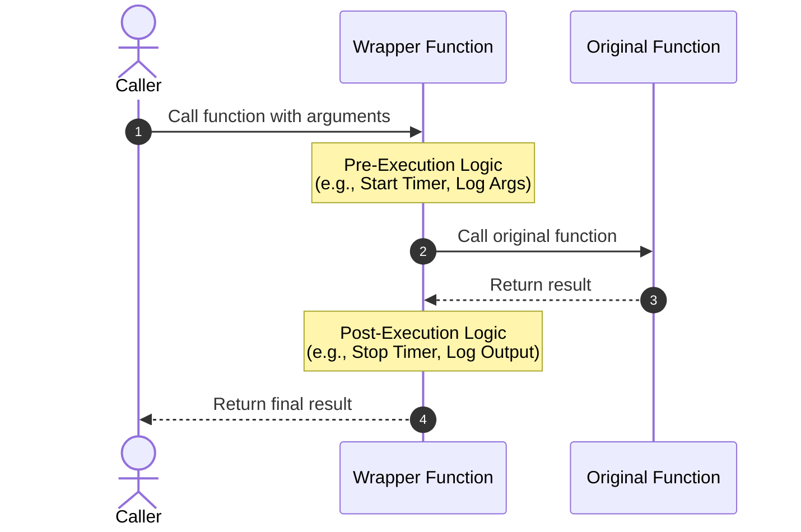
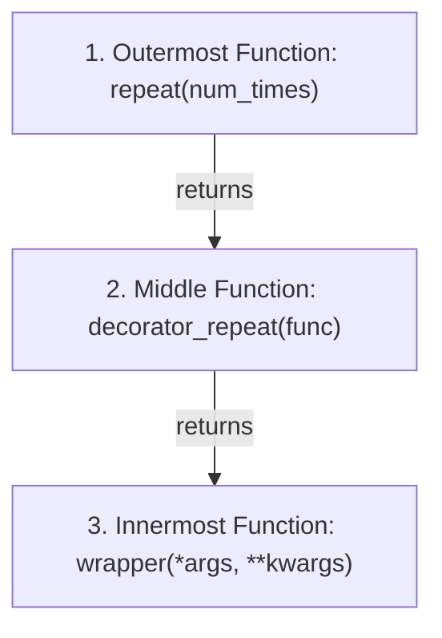

# Mastering Python Decorators: From Zero to Hero 🚀

Welcome to the ultimate guide to Python **Decorators**! Decorators are one of Python's most elegant, powerful, and expressive features. They allow you to dynamically alter or extend the behavior of functions or classes without permanently modifying their source code.

This guide will break down decorators starting from the absolute basics, then move through easy, medium, and advanced examples, all explaining the concepts in a simple, visual, and easy-to-understand way.

---

> [!NOTE]
> ### 🎁 The Decorator Analogy: Wrapping a Gift
> Think of a decorator like **wrapping a gift**:
> * **The Gift (Original Function):** The core item inside.
> * **The Wrapping Paper (Decorator):** Adds visual flair, protection, or bows around the gift without changing the gift itself.
> * **The Wrapped Gift (Wrapped Function):** The final package. When called, the wrapper code executes first, then the original function, then the wrapper finishes.



---

## 1. Prerequisites: Functional Python Foundations

Before writing decorators, we must understand three key properties of Python functions:

### A. Functions are First-Class Citizens
In Python, functions are objects. This means you can:
* Assign functions to variables.
* Pass functions as arguments to other functions.
* Return functions from other functions.

```python
def shout(text):
    return text.upper()

# 1. Assigning to a variable
yell = shout
print(yell("hello"))  # Output: HELLO
```

### B. Nested (Inner) Functions
You can define functions inside other functions. These inner functions are not accessible outside the parent function.

```python
def parent():
    print("Printing from parent()")
    
    def first_child():
        print("Printing from first_child()")
        
    first_child()

parent()
```

### C. Returning Functions & Closures
A function can return another function. An inner function can also access variables defined in the scope of its enclosing function, even after the enclosing function has finished executing. This is called a **Closure**.

```python
def make_multiplier(x):
    # Inner function remembers 'x' even after make_multiplier returns
    def multiplier(y):
        return x * y
    return multiplier

double = make_multiplier(2)
print(double(5))  # Output: 10
```

---

> [!TIP]
> ### 🔍 The Anatomy of a Decorator
> A decorator is a function that takes another function, wraps it inside an inner function with additional code, and returns the wrapper.
> 
> Here is how the control flow moves:



Here is the standard implementation structure:
```python
def my_decorator(func):                   # 1. Accepts original func
    def wrapper(*args, **kwargs):          # 2. Outer call wrapper
        # [Do something BEFORE func]
        result = func(*args, **kwargs)     # 3. Call original func
        # [Do something AFTER func]
        return result                      # 4. Return result
    return wrapper                         # 5. Return the wrapper
```

---

## 2. Basic Syntax: The `@` Symbol

Python provides the `@` symbol as **syntactic sugar** to make decorators easier to read and apply.

### Under the Hood: Without `@`
```python
def my_decorator(func):
    def wrapper():
        print("Something before.")
        func()
        print("Something after.")
    return wrapper

def say_hello():
    print("Hello!")

# Re-assigning the function to its decorated version
say_hello = my_decorator(say_hello)
say_hello()
```

### With `@` (Recommended Pythonic Style)
```python
@my_decorator
def say_hello():
    print("Hello!")

say_hello()
```
The `@my_decorator` line is exactly equivalent to `say_hello = my_decorator(say_hello)`.

---

## 3. Important & Easy Decorators (Beginner)

Let's look at simple, widely-used decorators. These are perfect for logging, tracking execution time, or debugging basics.

### 1. The `@timer` Decorator
Measures how long a function takes to execute. Highly useful for performance tuning.

```python
import time
import functools

def timer(func):
    @functools.wraps(func)  # Keeps the original function name and docstring
    def wrapper(*args, **kwargs):
        start_time = time.perf_counter()
        result = func(*args, **kwargs)
        end_time = time.perf_counter()
        run_time = end_time - start_time
        print(f"Finished {func.__name__!r} in {run_time:.4f} secs")
        return result
    return wrapper

@timer
def waste_some_time(num):
    for _ in range(num):
        sum([i**2 for i in range(1000)])

waste_some_time(100)
# Output: Finished 'waste_some_time' in 0.0543 secs
```

> [!IMPORTANT]
> **Why `functools.wraps`?**
> Always use `@functools.wraps(func)` on your wrapper function. Without it, your decorated function will lose its original identity (e.g., its `__name__` will become `"wrapper"`, and its docstring will be lost).

---

### 2. The `@logger` Decorator
Logs when a function is called, what arguments it received, and what it returned.

```python
import functools

def logger(func):
    @functools.wraps(func)
    def wrapper(*args, **kwargs):
        print(f"Calling {func.__name__} with args={args}, kwargs={kwargs}")
        result = func(*args, **kwargs)
        print(f"{func.__name__} returned {result!r}")
        return result
    return wrapper

@logger
def add(a, b):
    return a + b

add(5, 10)
# Output:
# Calling add with args=(5, 10), kwargs={}
# add returned 15
```

---

### 3. The `@slow_down` Decorator
Introduces a delay (sleep) before calling the function. Useful for debugging rate-limiting or simulating slow network requests.

```python
import time
import functools

def slow_down(func):
    @functools.wraps(func)
    def wrapper(*args, **kwargs):
        time.sleep(1)  # Pauses for 1 second
        return func(*args, **kwargs)
    return wrapper

@slow_down
def countdown(n):
    if n < 1:
        print("Blast off! 🚀")
    else:
        print(n)
        countdown(n - 1)

countdown(3)
# Pauses for 1 second between each line:
# 3
# 2
# 1
# Blast off! 🚀
```

---

## 4. Intermediate Decorators (Medium)

Now we will build decorators that are stateful, accept arguments, or perform smart computations like caching.

### 1. Decorators with Arguments (e.g., `@repeat(n)`)
To pass arguments to a decorator, you need **three nested functions**:
1. The outermost function accepts the decorator arguments.
2. The middle function accepts the target function.
3. The innermost function (the wrapper) accepts the target function's arguments.

> [!IMPORTANT]
> ### 🔄 Flow of Decorators with Arguments
> When a decorator accepts arguments (like `@repeat(num_times=3)`), we need **three levels of nested functions**:
> 1. **Outer Level:** Accepts the decorator arguments (e.g., `num_times`).
> 2. **Middle Level:** Accepts the target function (e.g., `func`).
> 3. **Inner Level:** The actual wrapper that accepts the function's arguments (`*args, **kwargs`).



Here is the nested code structure:
```python
def repeat(num_times):                       # 1. Takes decorator args
    def decorator_repeat(func):              # 2. Takes target function
        @functools.wraps(func)
        def wrapper(*args, **kwargs):        # 3. Takes function args
            for _ in range(num_times):
                result = func(*args, **kwargs)
            return result
        return wrapper
    return decorator_repeat
```

```python
import functools

def repeat(num_times):
    def decorator_repeat(func):
        @functools.wraps(func)
        def wrapper(*args, **kwargs):
            for _ in range(num_times):
                result = func(*args, **kwargs)
            return result
        return wrapper
    return decorator_repeat

@repeat(num_times=3)
def greet(name):
    print(f"Hello {name}!")

greet("Alice")
# Output:
# Hello Alice!
# Hello Alice!
# Hello Alice!
```

---

### 2. The `@memoize` (Caching) Decorator
Caches the results of a function so that duplicate calls with the same arguments do not re-run the computation. This turns exponential-time algorithms (like naive recursive Fibonacci) into linear-time algorithms.

```python
import functools

def memoize(func):
    cache = {}  # Stores results: {(args, kwargs): result}
    
    @functools.wraps(func)
    def wrapper(*args, **kwargs):
        # Dictionary keys must be hashable. Kwargs can be converted into sorted tuples.
        key = (args, tuple(sorted(kwargs.items())))
        if key not in cache:
            cache[key] = func(*args, **kwargs)
        return cache[key]
    
    wrapper.cache = cache  # Expose cache dictionary for inspection
    return wrapper

@memoize
def fibonacci(n):
    if n < 2:
        return n
    return fibonacci(n - 1) + fibonacci(n - 2)

print(fibonacci(35))  # Output: 9227465 (Executes instantly instead of taking minutes!)
```

---

### 3. The `@retry` Decorator
If a function raises an exception (e.g., due to temporary network failure), this decorator automatically retries the function a set number of times with an exponential backoff delay.

```python
import time
import functools
import random

def retry(retries=3, delay=1):
    def decorator_retry(func):
        @functools.wraps(func)
        def wrapper(*args, **kwargs):
            current_delay = delay
            for attempt in range(retries):
                try:
                    return func(*args, **kwargs)
                except Exception as e:
                    if attempt == retries - 1:
                        raise e  # Re-raise error if all attempts fail
                    print(f"⚠️ Failed: {e}. Retrying in {current_delay}s...")
                    time.sleep(current_delay)
                    current_delay *= 2  # Exponential backoff
        return wrapper
    return decorator_retry

@retry(retries=3, delay=1)
def unstable_network_call():
    if random.choice([True, False]):
        raise ConnectionError("Network timeout!")
    return "Data fetched successfully! 🎉"

print(unstable_network_call())
```

---

## 5. Expert Decorators (Advanced)

Let's dive into expert concepts: stateful class-based decorators, decorating methods, creating singletons, handling async functions, and building rate limiters.

### 1. Stateful Class-Based Decorators (with Method Binding Support)
A class can act as a decorator by implementing `__init__` (to accept the target function) and `__call__` (to run when the decorated function is called). 

> [!CAUTION]
> **The Method Binding Gotcha:**
> If you use a simple class-based decorator on a class **method**, it will fail! That is because the class instance is not passed as the first argument (`self`) because classes aren't automatically descriptors. 
> To fix this, we must implement `__get__` to support descriptor binding for instance methods.

```python
import functools
import types

class CountCalls:
    def __init__(self, func):
        self.func = func
        self.num_calls = 0
        functools.update_wrapper(self, func)  # Class equivalent of wraps()

    def __call__(self, *args, **kwargs):
        self.num_calls += 1
        print(f"Call {self.num_calls} of {self.func.__name__!r}")
        return self.func(*args, **kwargs)

    # Magic descriptor method to bind methods to instances
    def __get__(self, instance, owner):
        if instance is None:
            return self
        # Dynamically bind the __call__ method to the class instance
        return types.MethodType(self, instance)

# --- Usage 1: On a normal function ---
@CountCalls
def greet():
    print("Hello!")

greet()  # Call 1 of 'greet'
greet()  # Call 2 of 'greet'

# --- Usage 2: On a class method (thanks to __get__) ---
class User:
    def __init__(self, name):
        self.name = name

    @CountCalls
    def introduce(self):
        print(f"Hi, my name is {self.name}")

u = User("Bob")
u.introduce()  # Call 1 of 'introduce' -> "Hi, my name is Bob"
```

---

### 2. The `@singleton` Decorator
Decorating a class with `@singleton` ensures that only **one instance** of that class is ever created. Any subsequent constructor calls will return the first instance.

```python
import functools

def singleton(cls):
    """Make a class a Singleton class"""
    instances = {}

    @functools.wraps(cls)
    def wrapper_singleton(*args, **kwargs):
        if cls not in instances:
            instances[cls] = cls(*args, **kwargs)
        return instances[cls]
    
    return wrapper_singleton

@singleton
class DatabaseConnection:
    def __init__(self):
        print("Establishing DB connection...")

db1 = DatabaseConnection()  # Output: Establishing DB connection...
db2 = DatabaseConnection()  # (Prints nothing)

print(db1 is db2)  # Output: True
```

---

### 3. Decorating Async Functions (`@async_timer`)
Standard synchronous decorators will block or fail to measure time properly when decorating coroutines (`async def`). We must detect or build an async wrapper that uses `await` inside.

```python
import time
import asyncio
import functools

def async_timer(func):
    @functools.wraps(func)
    async def wrapper(*args, **kwargs):
        start_time = time.perf_counter()
        result = await func(*args, **kwargs)  # Crucial await
        end_time = time.perf_counter()
        print(f"Async {func.__name__!r} took {end_time - start_time:.4f}s")
        return result
    return wrapper

@async_timer
async def fetch_web_page(url):
    print(f"Fetching {url}...")
    await asyncio.sleep(1.5)  # Simulate network latency
    return "HTML Content"

# Run async code
asyncio.run(fetch_web_page("https://example.com"))
# Output:
# Fetching https://example.com...
# Async 'fetch_web_page' took 1.5012s
```

---

### 4. The `@rate_limit` Decorator
Limits a function to being called a maximum number of times (`max_calls`) within a certain time window (`period`). Any call exceeding this limit raises a `RuntimeError`.

```python
import time
import functools

def rate_limit(max_calls, period):
    def decorator(func):
        calls = []  # List to store timestamps of recent calls

        @functools.wraps(func)
        def wrapper(*args, **kwargs):
            now = time.time()
            # Remove calls that are older than the sliding time window
            nonlocal calls
            calls = [t for t in calls if now - t < period]

            if len(calls) >= max_calls:
                raise RuntimeError(f"Rate limit exceeded! Max {max_calls} calls per {period}s.")
            
            calls.append(now)
            return func(*args, **kwargs)
        return wrapper
    return decorator

@rate_limit(max_calls=3, period=5)
def ping():
    return "Pong!"

# Testing the rate limiter
print(ping())  # 1st call - Success
print(ping())  # 2nd call - Success
print(ping())  # 3rd call - Success
try:
    print(ping())  # 4th call - Fails (within 5 seconds)
except RuntimeError as e:
    print(e)  # Output: Rate limit exceeded! Max 3 calls per 5s.
```

---

## 6. Checklist: Best Practices for Decorators

Always keep these rules in mind when writing production-ready decorators:

| Rule | Rationale |
| :--- | :--- |
| **Always use `@functools.wraps`** | Prevents losing original function metadata (`__name__`, `__doc__`, annotations). |
| **Use `*args` and `**kwargs`** | Ensures your decorator is flexible and accepts functions with any signatures. |
| **Implement `__get__` for Classes** | If your class-based decorator is used on instance methods, it must support descriptors. |
| **Mind Async/Coroutine Types** | Check if the target function is a coroutine and handle it with `async def`/`await`. |
| **Keep Decorators Lightweight** | Decorators wrap functional logic; heavy operations should not be done on compile/decoration time. |

---
Congratulations, you are now a Python Decorator Pro! 🎓 Feel free to refer to this document whenever you need to build wrappers for logging, checking permissions, timing, or caching code.
